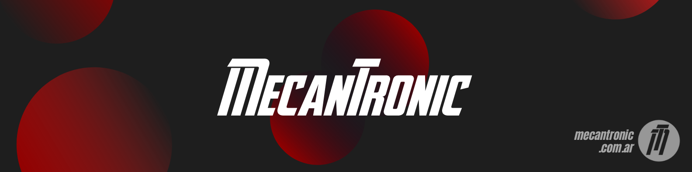

## Hi there 👋

## ¿Quiénes somos?

En Mec nos especializamos en proyectos *end to end*, integrando el *soft* y el *hard* para brindar soluciones llave en mano. Somos apasionados de la tecnología y estamos comprometidos con brindar la máxima calidad en nuestros productos y servicios.

Nuestras capacidades frente al cliente las resumimos en estas tres frases:

*Si tenés un problema te damos una idea.*
*Si tenés una idea te ayudamos a concretarla.*
*Si concretaste tu idea te ayudamos a potenciarla.*

Desarrollamos el ecosistema tecnológico más conveniente para nuestros clientes, centrando nuestros productos y servicios en estas 3 líneas de negocio:

- 🤖 Inteligencia artificial y ciencia de datos.
- 💻 Sistemas embebidos aplicados en *IoT*.
- 🦾 Diseño y prototipado 3D.

## Misión
💡 Implementar soluciones tecnológicas innovadoras de vanguardia en IoT e IA, para dar rápida respuesta a las necesidades de nuestros clientes.

## Visión
💡 Consolidarnos como una empresa de desarrollo que se encuentre trabajando permanentemente en la cresta de la ola tecnológica, con equipamiento e infraestructura adecuados para tal fin y con dinámicas de trabajo siempre aggiornadas a los tiempos que corren.

## Valores
💡 Excelencia e innovación y mejora continua

<!--

**Here are some ideas to get you started:**

🙋‍♀️ A short introduction - what is your organization all about?
🌈 Contribution guidelines - how can the community get involved?
👩‍💻 Useful resources - where can the community find your docs? Is there anything else the community should know?
🍿 Fun facts - what does your team eat for breakfast?
🧙 Remember, you can do mighty things with the power of [Markdown](https://docs.github.com/github/writing-on-github/getting-started-with-writing-and-formatting-on-github/basic-writing-and-formatting-syntax)
-->
